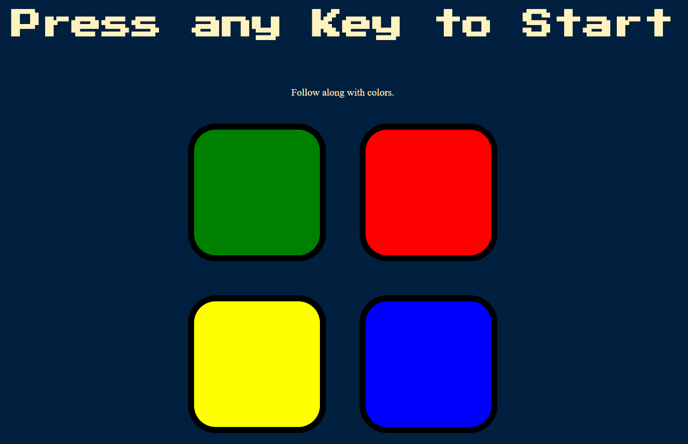

# Color-Game
The game is similar to the "Simon Game" which is a memory based game [a link](https://en.wikipedia.org/wiki/Simon_(game))
The rule is simple:
You will have to remember the sequence in which the colour is blinking.
Give it a try https://hmmonotone.github.io/Color-Game/

